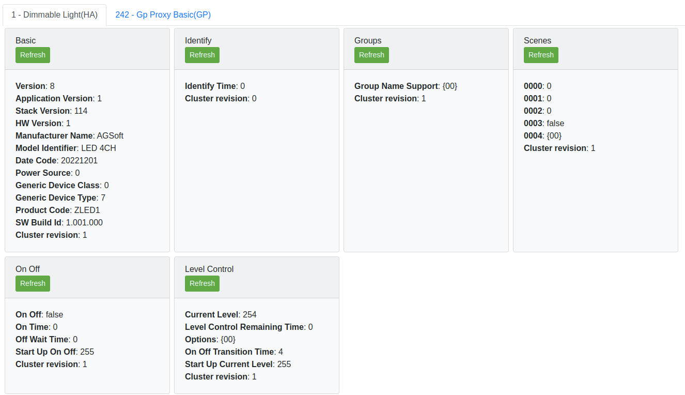

# Zigbee 3.0 4-channel LED strip controller

Zigbee 3.0 4-channel LED strip controller. Project includes both firmware and hardware.

## Hardware

The hardware of this device is based on Silicon Labs MGM210L module, commonly used in many Zigbee 3.0 products.

The main features:
- support for 12V/24V LEDs
- individual channel dimming
- support for 2 most common buck converters (for generating 3.3V)
- dual option for switching MOSFETs: for low current (<3A) SOT-23 and high current (<12A) DFN3x3A
- single button for pairing/resetting the device
- single status LED

## Firmware

The firmware is based on the latest Gecko SDK v7.2. The communication protocol used is Zigbee 3.0 (but it can be easily extended to support BLE in the same time, as Silicon Labs offers multi-protocol option).

Firmware features:
- Zigbee 3.0
- auto detection of number of mounted channels (when CH1 is mounted only then single Zigbee endpoint will be reported)
- works with motion sensors (like IKEA or Philips HUE) and remotes that implements OnOff/Level client clusters
- works with centralized (like IKEA Dirigera) and distributed (in ex. HUE) security networks
- doesn't support TouchLink, as this requires manufacturers TL keys
- support Find&Bind for linking with other Zigbee 3.0 devices on gateway-less setup
- each channel can be controlled individually (in ex. CH1 from motion sensor but CH2 from remote)

Following picture shows server clusters view for single channel components mounted (4 channel will have additional endpoints 2,3 and 4).

### Zigbee application operation

After boot-up app checks each channel output for mounted transistor, by pulling up channel GPIO and sensing logic level. When transistor is mounted then logic is LOW due to gate capacitance, else is HIGH. When channels are initialized, application checks if device is in network. If is in the network then just starts else executes network steering procedure to find network to join. When no open network is found, device forms it's own distributed security network.

### Button functionality

- long press (>3s) will trigger device factory reset (leave the current network, erase OTA storage and binding table)
- short press will open the network and make first channel identifying (connected LED strip will blink)
- second short press will move to identify next channel. If no more channels then will close the network.

When channel is identifying, other Zigbee 3.0 device can be linked to that channel. Just execute factory reset on other device and it should join the controller network and bind (using Find&Bind) if supported. I was testing this with IKEA devices (various remotes and motion sensors).

To join a remote to multiple channels you have to create zigbee group that includes those channels and bind to that group (unfortunately this requires to send some commands from Silabs CLI, unless you implement this as additional mode for button).

